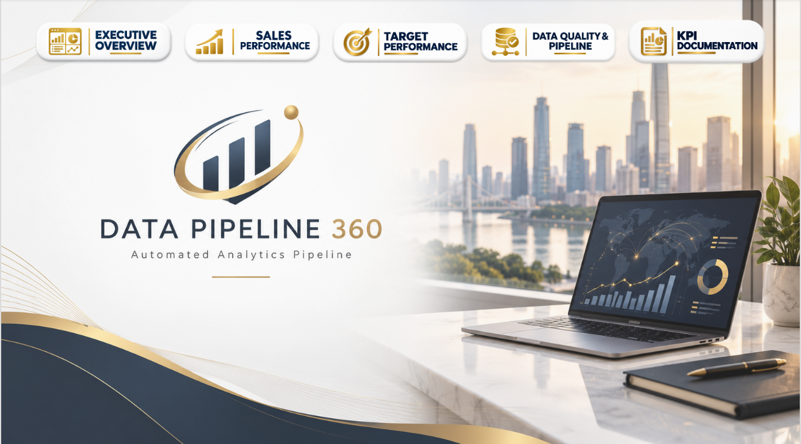

# Data Pipeline 360

End-to-end analytics pipeline built with **Python, SQL/SQLite and Power BI**.

The project demonstrates how raw CSV/Excel data can be ingested, validated, transformed, stored in a relational database and prepared for business intelligence reporting.

---

## Pipeline Architecture

```text
CSV / Excel Source Files
          │
          ▼
   Python Ingestion
          │
          ▼
 Data Quality Checks
          │
          ▼
Cleaning & Transformation
          │
          ▼
    SQLite Database
          │
          ▼
 SQL Views & Analysis
          │
          ▼
       Power BI
          │
          ▼
 Analytics Dashboard
```

---

## Project Objectives

The objective of Data Pipeline 360 is to build a structured and automated analytics workflow covering the main stages of a BI pipeline:

- Source file ingestion
- Data quality validation
- Data cleaning and transformation
- File processing and archiving
- Relational data storage
- SQL analytical modeling
- Pipeline monitoring
- Power BI reporting

---

## Technology Stack

| Technology | Usage |
|---|---|
| Python | Data ingestion, validation, transformation and automation |
| pandas | CSV processing and data manipulation |
| SQLite | Relational database and analytical storage |
| SQL | Data modeling, analytical views and business queries |
| Power BI | Data visualization and dashboard development |

---

## Project Structure

```text
data-pipeline-360/
│
├── data/
│   ├── sample/
│   ├── landing/
│   ├── raw/
│   ├── processed/
│   ├── rejected/
│   └── archive/
│
├── database/
│   └── data_pipeline_360.db
│
├── logs/
│
├── powerbi/
│
├── python/
│   ├── main.py
│   ├── config.py
│   ├── extract.py
│   ├── validate.py
│   ├── transform.py
│   ├── load.py
│   ├── file_manager.py
│   ├── logger.py
│   ├── load_targets.py
│   ├── create_file_history.py
│   ├── create_vw_sales_analysis.py
│   └── check_sqlite_schema.py
│
├── sql/
│   ├── create_tables.sql
│   ├── create_views.sql
│   └── analysis_queries.sql
│
├── DATA QUALITY & PIPELINE.png
├── EXECUTIVE OVERVIEW.png
├── HOME.png
├── SALES PERFORMANCE.png
├── TARGET PERFORMANCE.png
│
├── README.md
└── requirements.txt
```

---

# Python Pipeline

The Python layer orchestrates the complete processing workflow.

## 1. Extract

`extract.py` detects incoming sales files in the landing directory and loads the CSV data into pandas DataFrames.

## 2. Validate

`validate.py` performs data quality controls before data is allowed to continue through the pipeline.

The validation process covers **12 control areas**, including:

- Required columns
- Missing values
- Duplicate records
- Invalid dates
- Quantity validation
- Negative quantities
- Unit price validation
- Discount validation
- Sales amount validation
- Sales amount consistency
- Customer reference validation
- Product and store reference validation

Invalid files are rejected instead of being loaded into the analytical database.

## 3. Transform

`transform.py` prepares validated data for the relational model by:

- Cleaning text identifiers
- Converting dates
- Creating `DateKey`
- Converting numeric data types
- Selecting and ordering the final analytical columns

## 4. Load

`load.py` loads validated and transformed sales data into `Fact_Sales`.

The loading process uses:

```sql
INSERT OR IGNORE
```

to support controlled loading and prevent duplicate order lines from being inserted.

## 5. File Management

The pipeline manages files through dedicated processing directories:

```text
Landing
   │
   ├──► Raw
   │
   ├──► Processed
   │
   ├──► Archive
   │
   └──► Rejected
```

Valid files are processed and archived, while invalid files are moved to the rejected area.

## 6. Logging & Processing History

Pipeline execution is logged automatically.

The `File_History` table stores:

- File name
- Load date
- Processing status
- Rows read
- Rows inserted
- Rows rejected
- Error message

Previously processed successful files can therefore be identified and skipped.

---

# Data Model

The SQLite database contains **7 main tables**.

## Dimension Tables

```text
Dim_Customer
Dim_Date
Dim_Product
Dim_Store
```

## Fact Tables

```text
Fact_Sales
Fact_Targets
```

## Pipeline Monitoring

```text
File_History
```

The analytical model follows a star-schema-oriented structure, with `Fact_Sales` connected to the customer, product, store and date dimensions.

---

# SQL Layer

The SQL layer is separated into three scripts.

## `create_tables.sql`

Defines the SQLite relational schema, including:

- Primary keys
- Unique constraints
- Foreign keys
- Dimension tables
- Fact tables
- Pipeline history table

## `create_views.sql`

Creates the analytical views:

```text
vw_sales_analysis
vw_sales_daily
vw_sales_monthly
vw_customer_performance
vw_product_performance
vw_sales_vs_target
vw_data_quality
```

## `analysis_queries.sql`

Contains analytical SQL examples demonstrating:

- JOIN
- GROUP BY
- Aggregations
- CTEs
- CASE
- COALESCE
- NULLIF
- ROW_NUMBER
- RANK
- DENSE_RANK
- LAG
- PARTITION BY

The queries cover sales performance, customer analysis, product performance, monthly evolution, target achievement and pipeline monitoring.

---

# Data Quality

Data quality is integrated directly into the pipeline rather than being handled only at the reporting stage.

```text
Incoming File
      │
      ▼
Validation
   ┌──┴──┐
   │     │
 Valid  Invalid
   │     │
   ▼     ▼
Transform Rejected
   │
   ▼
 Database
```

This prevents files that fail validation from contaminating the analytical dataset.

---

# Pipeline Monitoring

Each processed file receives a processing status in `File_History`.

Typical statuses include:

```text
SUCCESS
FAILED
ERROR
```

The pipeline also produces an execution summary containing processed, successful, failed, skipped and error file counts.

---

# Power BI Dashboard

The curated analytical data is consumed in **Power BI** to provide the final reporting and visualization layer.

The portfolio version presents five main report pages:

- Home
- Executive Overview
- Sales Performance
- Target Performance
- Data Quality & Pipeline

---

## Home



---

## Executive Overview


---

## Sales Performance


---

## Target Performance


---

## Data Quality & Pipeline


---

# Key Skills Demonstrated

This project demonstrates practical experience with:

**Python • pandas • SQL • SQLite • ETL • Data Quality • Data Modeling • Automation • Power BI • Business Intelligence**

It demonstrates the complete analytical workflow from source-file ingestion through data validation and relational modeling to final business intelligence reporting.

---

# Author

**Mourad Chafiqi**  
Data Analyst | BI Developer  
Power BI • SQL • Python • DAX  
Casablanca, Morocco

**Portfolio:**  
https://mourad83.github.io/

**LinkedIn:**  
https://www.linkedin.com/in/mourad-chafiqi-4062b8140
